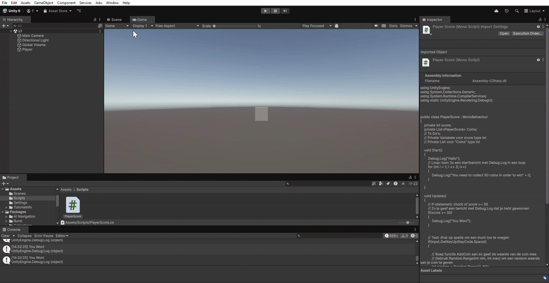
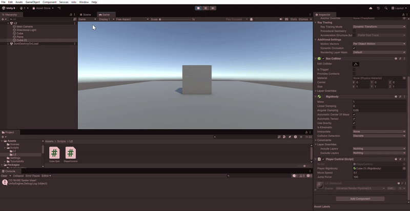
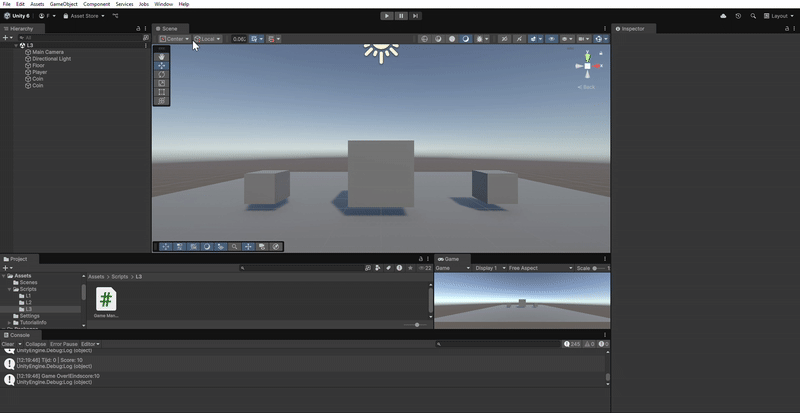
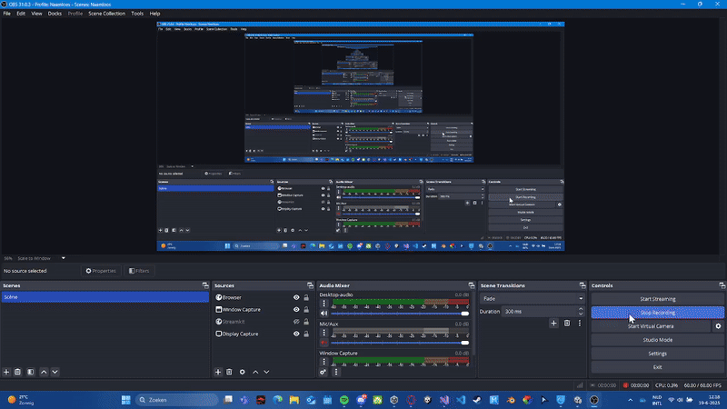
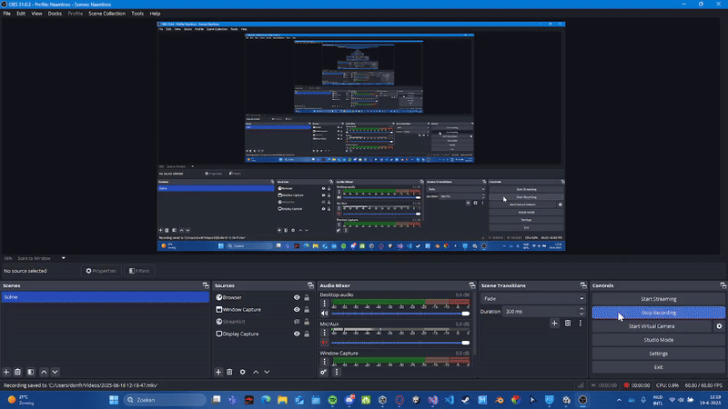

# Prog M4 Les 1 "Score en Munten"

## Hier zie je dat elke keer wanneer er op de spatiebalk wordt gedrukt, er een willekeurig getal tussen de 1 en 50 wordt gegenereerd en in de Console wordt weergegeven. 

## Elke keer dat er een getal wordt gegenereerd, wordt het bij het vorige getal opgeteld en laten zien in de Console totdat het bij elkaar op 50 of meer uitkomt.

## Als deze criteria is behaald, wordt er een nieuw bericht weergegeven in de Console die aangeeft dat je hebt gewonnen.

### Script:

[Script](Assets/Scripts/L1/PlayerScore.cs)

# Prog M4 Les 2 "Bewegende Speler"

## Hier zie je dat wanneer de pijltjestoetsen worden ingedrukt, de kubus naar links en rechts beweegt. 

## Ook kun je zien dat wanneer er op de spatiebalk wordt gedrukt, de kubus in de lucht springt.

### Script:

[Script](Assets/Scripts/L2/PlayerControl.cs)

# Prog M4 Les 3 "Timed Muntjacht"

## Hier zie je dat wanneer ik de game start, een timer van 20 seconden aftelt , terwijl deze timer aan is, moet de speler de "coins" (kleinere cubussen) aanraken om punten te verdienen. (Dit wordt weergegeven in de console).

## Elke keer dat de speler een "Coin" aanraakt, wordt der 10 bij de score opgeteld. (dit wordt weergegeven in de console).

## Als de timer stopt en je een bepaald aantal punten wel of niet hebt behaald, wordt het weergegeven in de console. 

### Script:

[Script](Assets/Scripts/L3/Game%20Manager.cs)

# Prog M4 Les 4 "Start en Spel"

## Hier zie je in de Unity User Interface, dat wanneer ik de game start, de scene 'L4' wordt vertoond. Zodra ik op spatie druk, verandert de scene naar een nieuwe scene 'L4.1'.

## Hierin bevindt zich een simpele game waarin je door de pijltjestoetsen of 'A' en 'D' toetsen indrukt, je de kubus naar rechts en naar links kunt bewegen.

## Ook zie je een coin op de grond liggen, maar die heeft voor nu geen functie. 

### Scripts:

[Script](Assets/Scripts/L4/Player%20Control%202.cs)

[Script](Assets/Scripts/L4/Scene%20Switcher.cs)

# Prog M4 Les 5 "Gestructureerde Muntjager"

## Hier zie je dat zodra ik de game start een error krijg.

## Deze error is expres gemaakt om te kijken of het script van de Score Manager wel is ingesteld.

## Ook zie je een kubus en een coin op een plane, als je de coin door de pijltjes en- de 'A' en 'D' toetsen met de kubus raakt, zal de coin verwijderen en er een bericht worden gegeven in de console dat aangeeft dat je tien punten hebt gescoord en jouw totale score nu in dit geval 10 is.. 

### Scripts:

[Script](Assets//Scripts/L5/Player%20Move.cs)

[Script](Assets/Scripts/L5/Score%20Manager.cs)